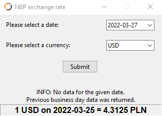

# NBP Exchange Rates
> Middle exchange rates of foreign currencies in PLN – table A

## Table of Contents
* [General Info](#general-information)
* [Technologies Used](#technologies-used)
* [Screenshots](#screenshots)
* [Project Status](#project-status)
* [Room for Improvement](#room-for-improvement)
* [Acknowledgements](#acknowledgements)
* [Contact](#contact)

## General Information
- Archival exchange rate based on the Polish National Bank 
- Current average exchange rates of foreign currencies in zlotys
- If the data is unavailable for given date, it returns the data from the previous business day 
- Simple user interface 

## Technologies Used
- Python 3.10
- Modules:
    - tkinter
    - tkcalendar
    - requests
    - datetime

## Screenshots

## Project Status
Project is: _in progress_  - first mini project 
- Currently supported currencies:
    - USD, EUR, CHF

## Room for Improvement
To do:
- add more currencies
- tba...

## Acknowledgements
- This project was based on one of the challenges from  [Praktyczny Python](https://www.youtube.com/channel/UCrxH8koAWHNd73ZCNTvCHSQ)
- drop down calendar from [j_4321](https://stackoverflow.com/a/48309092/16855399)

## Contact
Created by [@irekwiecha](https://github.com/irekwiecha)

